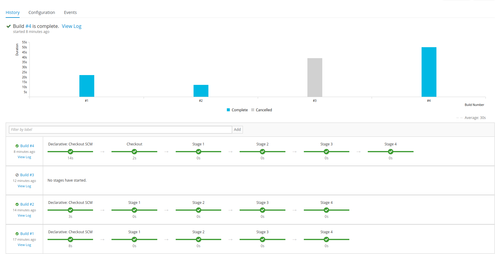

### What is this?

An example OpenShift pipeline template with Jenkinsfile.

### How do I use this?
```bash
cd jenkins-slave
# set registry variable to openshift docker registry url
# usually it's docker-registry-default.$OCSUBDOMAIN/
# if using oc cluster up, it's docker-registry-default.127.0.0.1.nip.io
./build.sh # build slave image
cd ../ # return to project root

ssh-keygen -f id_rsa # generate clean ssh keys in current dir
# if needed, don't forget to add the pub keys to git deploy keys

oc create secret generic \
  git-deploy-key \
  --from-file=id_rsa=id_rsa \
  --from-file=id_rsa.pub # save ssh keys in openshift secret

oc create -f openshift-pipeline-example.yaml # create pipeline
oc start build example-pipeline # start build
```  

### Required resources?
An OpenShift/OKD Cluster and the [oc cli](https://www.okd.io/download.html#oc-platforms).  
For further information, consider some OKD [docs](https://github.com/openshift/origin/tree/master/examples/jenkins/pipeline).


### Screenshots

